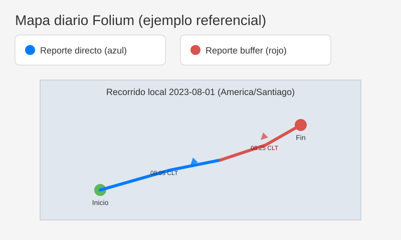

# Queclinck-Homlogador-Tramas

Herramientas para homologar y analizar tramas Queclink (`+RESP:GTERI` y `+RESP:GTINF`) de los
modelos GV310LAU, GV58LAU y GV350CEU. Permite convertir archivos de texto/CSV/XLSX a una base de
datos SQLite y, a partir de ella, generar mapas diarios con los recorridos diferenciando entre
reportes buffer y no buffer.

## Requisitos

- Python 3.9 o superior.
- Dependencias opcionales del parser: `pandas` y `openpyxl` (para leer CSV/XLSX).
- Dependencias del módulo de visualización: `folium`, `pytz`, `python-dateutil`.

Instala los paquetes mínimos para los mapas con:

```bash
pip install folium pytz python-dateutil
```

## Homologación de tramas GTINF/GTERI

Ejemplo rápido para convertir un archivo de tramas a SQLite:

```bash
python queclink_tramas.py --in datos.txt --out salida.db
```

### Detección automática de mensaje y modelo

El CLI identifica el tipo de mensaje leyendo el `Head` (`+RESP:GTINF`, `+BUFF:GTERI`, etc.) y
extrae el nombre corto (`INF`, `ERI`) para localizar automáticamente el archivo YAML adecuado
(`spec/<modelo>/<mensaje>.yml`).

El modelo se determina exclusivamente por los **primeros ocho dígitos del IMEI**:

- `86631406` → **GV58LAU**
- `86858906` → **GV310LAU**
- `86252406` → **GV350CEU**

Si el prefijo no está homologado se omite la trama y se deja un log de advertencia.

### Esquema estrictamente definido por YAML

Cada spec define los campos disponibles para un mensaje y modelo concretos. La base de datos
SQLite se crea (o amplía) únicamente con esas columnas. El proceso de ingestión nunca agrega
columnas auxiliares como `raw_line`, `is_buffer`, `send_time`, `count_number` o similares a menos
que estén declaradas explícitamente en el YAML.

La lógica del parser también respeta los campos opcionales controlados por máscaras (por ejemplo
`position_append_mask.bitX` o `eri_mask.bitY`), cargando solamente los datos habilitados en la
trama.

## Visualización de recorridos diarios

El módulo `viz` entrega un CLI que genera un mapa HTML (Folium) y un GeoJSON agrupando los
recorridos por día local (`America/Santiago`). Los puntos buffer se dibujan en rojo y los
reportes directos en azul, incluyendo tooltips con hora local y coordenadas.


### Ejemplos de uso

**Linux/macOS**

```bash
python -m viz.cli \
  --db salida.db \
  --imei 8646960600004173 \
  --date 2023-08-01 \
  --provider "CartoDB Positron" \
  --out mapas/gv310lau_2023-08-01


```bash
python -m viz.cli \
  --db salida.db \
  --imei 864696060004173 \
  --date 2023-08-01 \
  --provider "CartoDB Positron" \
  --out mapas/gv310lau_2023-08-01
```


**Windows (PowerShell)** – usa el acento grave `` ` `` como continuador y el lanzador `py`:

```powershell
py -m viz.cli `
  --db salida.db `
  --imei 8646960600004173 `
  --date 2023-08-01 `
  --provider "CartoDB Positron" `
  --out mapas/gv310lau_2023-08-01
```

**Windows (CMD)** – usa `^` como continuador:

```cmd
py -m viz.cli ^
  --db salida.db ^
  --imei 8646960600004173 ^
  --date 2023-08-01 ^
  --provider "CartoDB Positron" ^
  --out mapas/gv310lau_2023-08-01
```

Consulta `docs/viz/windows.md` para más consejos y una captura de pantalla del resultado.

El comando anterior creará los archivos:

- `mapas/gv310lau_2023-08-01.html`: mapa interactivo listo para compartir.
- `mapas/gv310lau_2023-08-01.geojson`: puntos del recorrido con hora local y tipo de reporte.

Para más ejemplos y capturas de pantalla revisa `docs/viz/mapas.md`.

## Mapas interactivos por IMEI y operador

El script `generate_map.py` construye mapas dinámicos por IMEI combinando la
información de las bases `gteri_<modelo>.db`, `gtfri_<modelo>.db` y
`gtinf_<modelo>.db`. Cada punto se vincula con la información de red más
próxima (`network_type`, `csq/ber`) para colorear el recorrido según la
tecnología y la calidad de señal. Además, se agregan controles para filtrar por
operador, tecnología (2G/3G/4G) y día (`send_time`).

### Ejecución rápida

```bash
python generate_map.py \
  --model gv350ceu \
  --imei 862524060869597 \
  --report gteri \
  --db-dir bases_sqlite \
  --out-dir mapas
```

El comando genera un archivo `mapa_<modelo>_<imei>.html` en el directorio de
salida (`mapas/mapa_gv350ceu_862524060869597.html` en el ejemplo).

### Filtros disponibles

- `--day YYYY-MM-DD`: limita el mapa a un día específico (comparando con
  `send_time`).
- `--operator <Claro|Movistar|Entel>`: filtra por operador; acepta múltiples
  valores repitiendo el flag.
- `--network <2G|3G|4G>`: restringe la visualización a una o varias
  tecnologías.
- `--report gteri|gtfri`: selecciona la fuente de coordenadas a usar (por
  defecto mezcla ambas).

El HTML resultante permite activar/desactivar capas por día, operador y
tecnología, y cada marcador muestra un tooltip con la intensidad de señal
estimada (RSSI/RSRP en dBm, CSQ y BER cuando corresponde).

### Ejemplo de salida



## Pruebas

Ejecuta los tests (incluye las validaciones del módulo de visualización):

```bash
pytest
```
