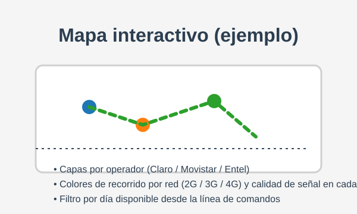

# Queclinck-Homologador-Tramas

Herramientas para homologar tramas de dispositivos Queclink y explorar los recorridos registrados.

## Procesamiento de tramas

El script `queclink_tramas.py` permite normalizar tramas `+RESP:GTERI` (y `+BUFF:GTERI`) desde archivos `.txt`, `.csv` o `.xlsx` y generar bases SQLite por modelo de equipo. Consulte la ayuda integrada:

```bash
python queclink_tramas.py --help
```

## Mapas interactivos por IMEI

El módulo `viz/mapa_recorridos.py` agrega la posibilidad de generar mapas Folium a partir de las bases `gteri_<modelo>.db`, `gtfri_<modelo>.db` y `gtinf_<modelo>.db` generadas por el homologador. Cada mapa agrupa los puntos por IMEI, permite filtrar por operador (Claro, Movistar o Entel), día y tecnología de red (2G/3G/4G), y colorea los recorridos según la calidad de señal calculada a partir de los campos CSQ/RSRP.

### Modelos disponibles (GTERI/GTFRI enriquecidos con GTINF)

- GV310LAU
- GV350CEU
- GV58LAU
- GV30CAU

### Uso rápido

```bash
python generate_map.py --model gv350ceu --imei 862524060869597 --reports gteri gtfri --day 2024-01-15
```

Argumentos principales:

- `--model`: modelo del equipo (por ejemplo `gv350ceu`).
- `--imei`: IMEI a graficar.
- `--reports`: reportes a utilizar (`gteri`, `gtfri`), por defecto se usan ambos.
- `--day`: filtra los puntos por día (`YYYY-MM-DD`).
- `--base-dir`: directorio que contiene los archivos SQLite (por defecto el actual).
- `--output`: ruta del HTML generado (por defecto `mapa_<modelo>_<imei>.html`).
- `--gteri-table` / `--gtfri-table` / `--gtinf-table`: permiten indicar un nombre de tabla específico si la base contiene varias.

El comando crea un archivo HTML (`mapa_<modelo>_<imei>.html`) con:

- Capas activables por operador (Claro, Movistar, Entel) basadas en los campos `mcc`/`mnc`.
- Capas activables por tecnología (`network_type`) con polilíneas coloreadas (2G, 3G, 4G).
- Marcadores con color según la calidad de señal calculada por tecnología (Pésima/Regular/Buena/Excelente).
- Tooltips que muestran `send_time`, reporte de origen, operador y métricas de señal sincronizadas con GTINF por la marca de tiempo más cercana.

### Ejemplo de salida



El HTML generado puede abrirse en cualquier navegador moderno para interactuar con los filtros y capas disponibles.
